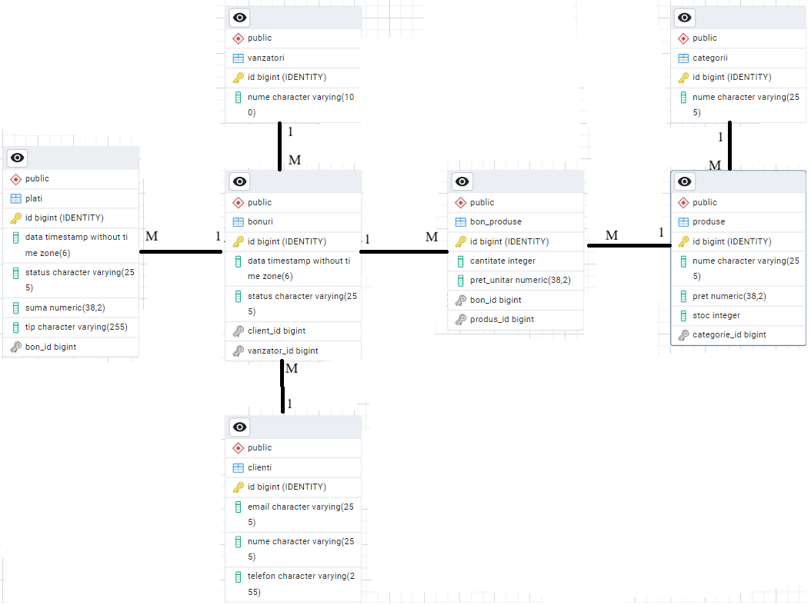

# 🧾 POS – Casa de Marcat (Spring Boot)

## 📌 Descriere generală
Acest proiect reprezintă o aplicație backend de tip **POS (Point of Sale)** – casă de marcat – dezvoltată în **Java cu Spring Boot**, având ca scop gestionarea vânzărilor, produselor, clienților, bonurilor fiscale și plăților.

Aplicația implementează un flux complet de vânzare:
- definirea produselor și a categoriilor
- deschiderea unui bon
- adăugarea produselor pe bon
- efectuarea plății
- actualizarea stocului

---

## 🧠 Business Requirements
Aplicația respectă următoarele cerințe de business:

1. Un produs aparține unei categorii și are preț și stoc.
2. Un client poate avea mai multe bonuri.
3. Un bon este emis de un singur vânzător.
4. Un bon poate conține mai multe produse (cu cantitate).
5. Un produs poate apărea pe mai multe bonuri.
6. Stocul produselor se reduce la adăugarea pe bon.
7. Un bon poate fi plătit o singură dată.
8. Plata poate fi CASH sau CARD.
9. Un bon are status (OPEN / PAID).
10. Toate operațiile invalide sunt blocate prin validări și excepții.

---

## 🔄 Flow principal (Vânzare)

1. Se creează categorii și produse
2. Se creează client și vânzător
3. Se creează un bon fiscal (status = OPEN)
4. Se adaugă produse pe bon  
   → stocul se reduce automat
5. Se efectuează plata bonului  
   → bonul devine PAID  
   → se creează o plată
6. Se pot lista detaliile bonului și plățile aferente

---

## 🗂️ Diagrama ERD
Diagrama Entitate–Relație descrie structura bazei de date și relațiile dintre entități.

📌 **ERD-ul se găsește aici:**  

---

## 🧱 Entități principale
- **Categorie**
- **Produs**
- **Client**
- **Vanzator**
- **Bon**
- **BonProdus** (entitate de legătură)
- **Plata**

---

## 🌐 REST API – Endpoint-uri

### Categorii
- `POST /api/categorii`
- `GET /api/categorii`

### Produse
- `POST /api/produse`
- `GET /api/produse`
- `GET /api/produse/categorie/{categorieId}`
- `PUT /api/produse/{id}/stoc`

### Clienți
- `POST /api/clients`
- `GET /api/clients`

### Vânzători
- `POST /api/vanzatori`
- `GET /api/vanzatori`

### Bonuri
- `POST /api/bons`
- `POST /api/bons/{bonId}/produse`
- `GET /api/bons/{bonId}`
- `POST /api/bons/{bonId}/pay`
- `GET /api/bons/{bonId}/plati`

---

## ✅ Validări

### Validări structurale (`@Valid`)
Aplicate pe DTO-uri:
- `@NotNull`
- `@NotBlank`
- `@Email`
- `@Positive`
- `@PositiveOrZero`

Acestea generează automat **400 Bad Request**.

### Validări de business
Implementate în servicii:
- produs inexistent
- categorie inexistentă
- stoc insuficient
- bon deja plătit
- bon inexistent

Acestea generează **400 / 404**, în funcție de caz.

---

## ⚠️ Excepții
Aplicația folosește:
- excepții custom de business
- `try/catch` în service
- transformarea excepțiilor în `ResponseStatusException`

Pentru claritate, mesajele de eroare sunt returnate către client.

---

## 🧪 Testare

### Tipuri de teste implementate
- **Controller Tests** (`@WebMvcTest`)
- **Service Tests** (Mockito)

### Acoperire
- toate endpoint-urile REST
- toate serviciile
- cazuri pozitive (success)
- cazuri negative (400 / 404 / business rules)

